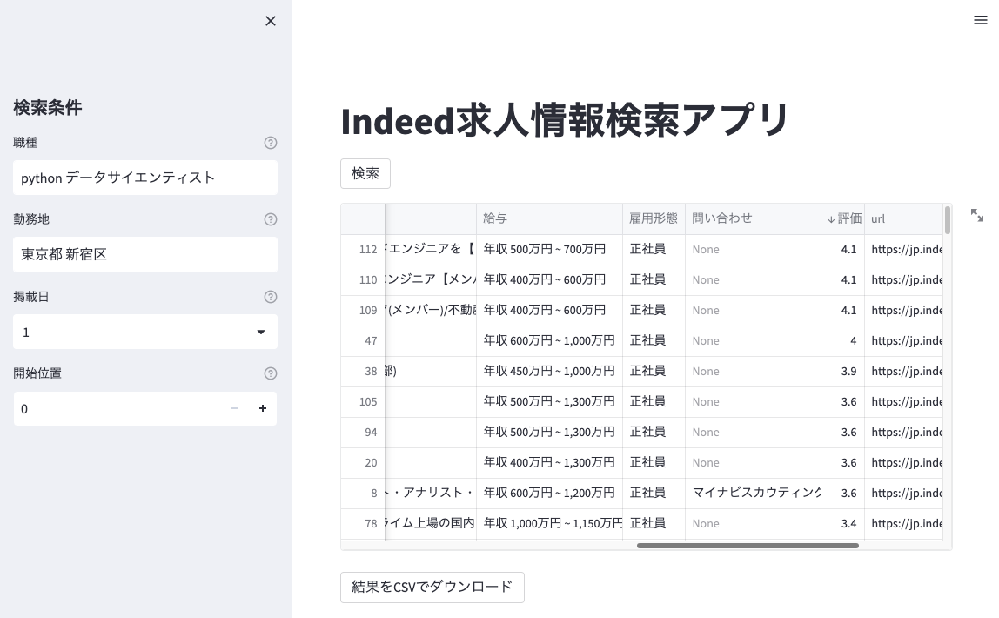

# Indeed 求人情報検索アプリ 仕様書

## 概要

このアプリは、Indeed の求人情報を検索し、結果を表示する Streamlit アプリです。ユーザーは職種、勤務地、掲載日、検索結果の開始位置を指定して求人情報を検索できます。

## 機能

- **職種、勤務地の入力**: ユーザーは希望する職種と勤務地を入力できます。
- **掲載日の選択**: 求人情報の掲載日数を 1, 3, 7, 14 日から選択できます。
- **検索結果の開始位置の指定**: 検索結果の開始位置を指定できます。
- **求人情報の検索と表示**: 指定された条件で Indeed の求人情報を検索し、結果を表示します。
- **結果の CSV ダウンロード**: 検索結果を CSV ファイルとしてダウンロードできます。
  

## 技術スタック

- **Python**: バックエンドの主要言語。
- **Streamlit**: フロントエンドの構築に使用。
- **Pandas**: データの処理と CSV ファイルの生成に使用。
- **BeautifulSoup**: HTML の解析に使用。
- **DrissionPage**: Web ページの取得に使用。

## インストール方法

1. 必要なライブラリをインストールします。
   ```
   pip install -r requirements.txt
   ```
2. アプリを起動します。
   ```
   streamlit run app.py
   ```

## 使用方法

1. サイドバーに表示される検索条件を入力または選択します。
2. 「検索」ボタンをクリックして、求人情報を検索します。
3. 検索結果が表示されます。結果は CSV ファイルとしてダウンロードすることもできます。

## 注意事項

- このアプリは、Indeed の Web サイトの構造に依存しています。Web サイトの構造が変更された場合、アプリが正しく機能しなくなる可能性があります。
- 検索結果の取得には時間がかかる場合があります。特に、検索条件によっては多数のページを取得する必要があるため、応答時間が長くなることがあります。
